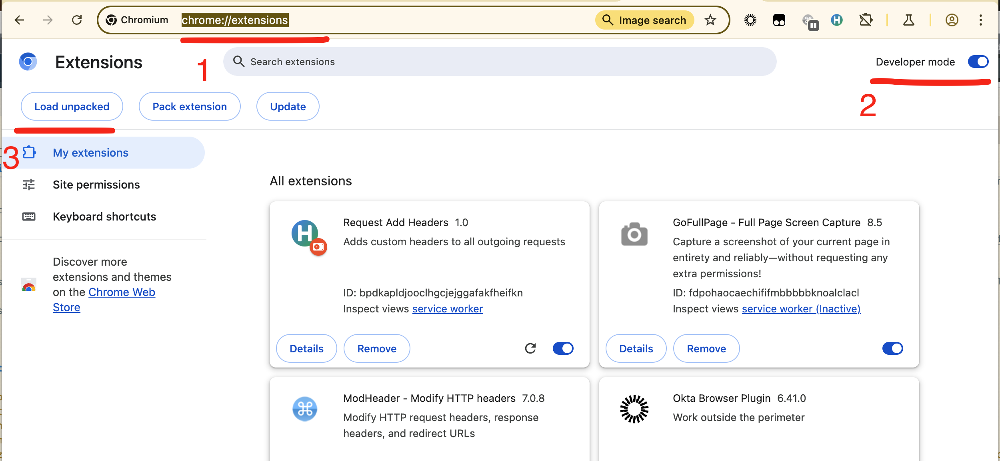
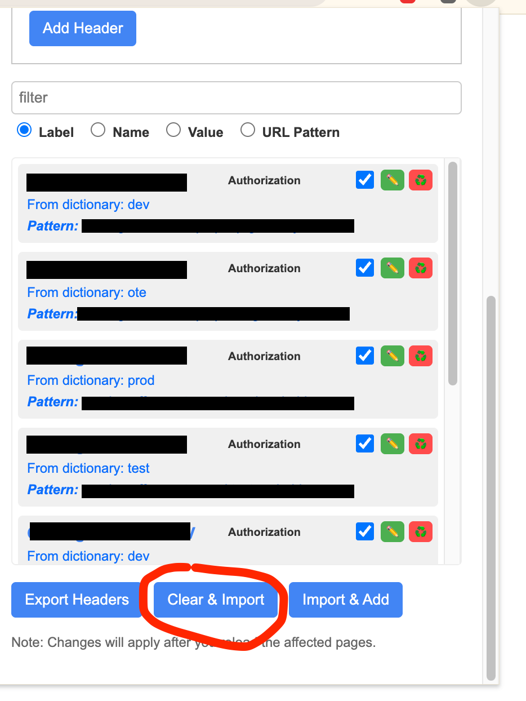
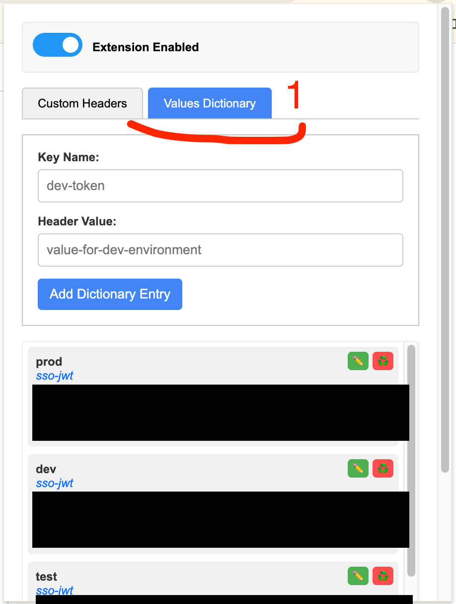

# Description

When working with Swagger across different services, we often need to switch between multiple instances - whether it's different services entirely or the same service deployed in various environments (e.g., dev, staging, prod).

A common pain point is that Swagger usually requires reauthentication each time a tab is closed and reopened. Keeping the tab open to avoid reauthentication isn’t ideal either, as it can quickly lead to having too many open tabs.

Additionally, refreshing the page also triggers the need to reauthenticate.

To make things worse, some Swagger instances don’t even load unless you're already authenticated with `Authorization` header. In such cases, a popular Chrome extension like [ModHeader](https://chromewebstore.google.com/detail/modheader-modify-http-hea/idgpnmonknjnojddfkpgkljpfnnfcklj?hl=en) can be used to inject the `Authorization` header manually.

However, using ModHeader comes with its own inconvenience - you need to remember to turn it on and off when switching between services. Accidentally leaving it enabled can break unrelated pages (e.g., loading images in Jira tickets) by injecting unnecessary headers.

Another problem with enabling/disabling is that if user forget to turn off ModHeader for given page and go to Google or any other page the Auhorization header will be sent there too - os it essentially causes Auth token to leak all over the internet.

Also when switching between PROD, DEV, TEST you either will have to switch ModHeader profiles or update the header manually each time.

After using ModHeader for a while, I realized this process could be significantly improved-especially in the modern era of vibecoding.

So, I built a simple plugin in basically one evening - and documented it the next.

Well, that is not quite true. Because some parts were not working properly so I had to tweak them manually, and once I've decided to show it to bigger audience I also wanted to make sure it will do it's job without disrupting other things - so few more evenings added to that.

# Disclaimer

The plugin is fully self-contained: it does not load scripts from any external sources, nor does it export or share any data externally.

All state used by the plugin is stored and managed locally.

This can be easily verified by inspecting the code in this repository.

In fact this is really simple plugin - so most web devs should be able to understand its structure. Possibly even in few minutes.

# Main features

- add custom headers
- ability to define to what pages given header should be injected
- persistance of values and configuration (reloading or closing tab is not an issue anymore)
- export/import of configuration (for better colaboration with team members)
- centralized place for commonly used values (jwt tokens) which later might be picked by name to individual header rules.

Last point from list above is actually whole purpose of that plugin to have single place for TEST token which can be used in multiple rules. Single place for PROD token... single place for DEV and so on.

Now just update `test` jwt token in dictionary and it will be picked up by configuration and injected to all TEST swaggers.

Basically the goals is to update four tokens (PROD, DEV, TEST, OTE) in the dictionary tab of the plugin and you are authenticated across all swagggers in the company until those expire.

# Testing in dev mode

- download this git repository
- open chrome://extensions in Chrome _(point 1 - Image 1)_
- enable "Developer mode" in the top right corner _(point 2 - Image 1)_
- click "Load unpacked" and point it to [extension](extension) directory from this repository _(point 3 - Image 1)_
- import (using the plugin) configuration from [exports/customHeaders.json](exports/customHeaders.json) file _(point 1 - Image 2)_
- then define `test`, `dev`, `prod` and `ote` items in the dictionary _(point 1 - Image 3)_

(INFO: In case any updates will be ever published via git, just pull latest git changes and hit "Reload" button in the tail representing the extension in the chrome://extensions)

|  |
| :---------------------------------------------------: |
|                        Image 1                        |

|  |
| :---------------------------------------------------: |
|                        Image 2                        |

|  |
| :---------------------------------------------------: |
|                        Image 3                        |

# Dev note

These [documents](documents) should stay in the repository. Those are important for the extension to be accepted by Chrome Web Store.
